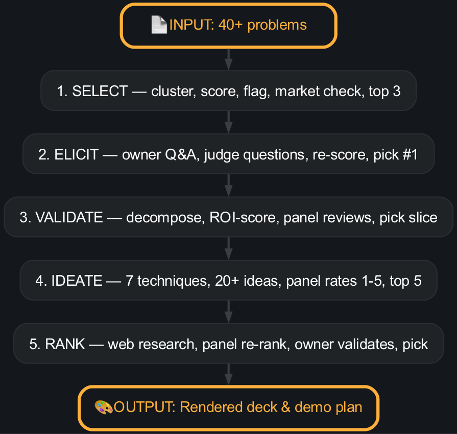
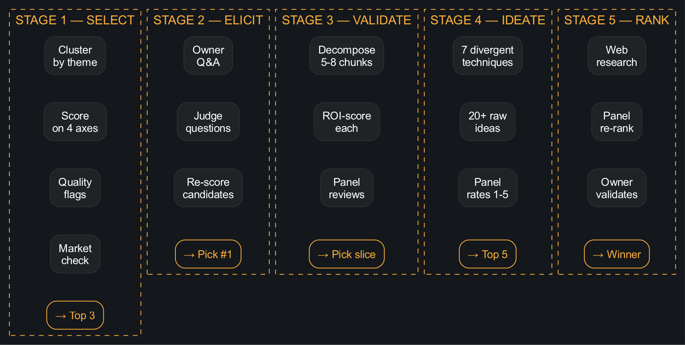

<style>
@import url('https://fonts.googleapis.com/css2?family=Jockey+One&display=swap');

section {
  background: #14171c;
  color: #ffffff;
  font-family: Arial, Helvetica, sans-serif;
  padding: 30px 55px;
}

h1, h2, h3 { font-family: 'Jockey One', Arial, sans-serif; font-weight: 400; }
h1 { color: #fcaf3b; font-size: 2rem; margin-bottom: 0.3rem; }
h2 { color: #fcaf3b; font-size: 1.5rem; margin-bottom: 0.3rem; }

p, li { color: #ffffff; font-size: 0.95rem; line-height: 1.5; }
code { background: #202325; padding: 0.1em 0.3em; border-radius: 3px; font-size: 0.8rem; color: #fcaf3b; }
pre { background: #202325; border-radius: 6px; padding: 0.6rem 0.8rem; border-left: 3px solid #fcaf3b; font-size: 0.85rem; }

table { border-collapse: collapse; width: 100%; font-size: 0.9rem; }
th { background: #202325; color: #fcaf3b; padding: 6px 10px; border: 1px solid #2a2e33; }
td { background: #1a1a1a; padding: 6px 10px; border: 1px solid #2a2e33; color: #ffffff; }
strong { color: #fcaf3b; }
a { color: #fcaf3b; }

section.lead { text-align: center; }
section.lead h1 { font-size: 2.8rem; margin-bottom: 1rem; }
section.lead p { font-size: 1.15rem; }

section { padding: 25px 50px; }

section.diagram { padding: 0; display: flex; align-items: center; justify-content: center; }
section.diagram img { max-width: 95%; max-height: 90%; object-fit: contain; }
</style>

<!-- _class: lead -->

# How to Win a Hackathon

**From 40+ problems to a winning pitch — the process that judges can't ignore.**

An agent that walks you through every step,
with 12 domain-expert judges reviewing your work.

---

<!-- _class: diagram -->



---

<!-- _class: diagram -->



---

## How Most Teams Fail

They open a CSV of 40+ problems, pick one on gut feel, brainstorm 3 obvious ideas, and code for 47 hours.

**What judges see:** The wrong problem (nobody asked the owner). Zero validation (just the team's opinion). No awareness ("nobody else is doing this" — they are). A generic demo that works but tells no story.

---

## Stage 1 — Problem Selection

**Goal:** Pick the right problem — not the first one or the easiest one.

| Do ✅ | Don't ❌ |
|---|---|
| **Cluster** all problems by theme | Pick the one with the catchiest name |
| **Score** each cluster on impact × feasibility | Ignore the ones that sound boring |
| **Check the market**: competitors? already deployed? | Assume nobody has ever thought of this |
| **Flag** quality: too vague? needs hardware? too big? | Pretend a 6-month problem fits in 48 hours |

The agent parses the CSV, clusters, scores, checks the market, and surfaces the top 3. You pick one.

---

## Stage 2 — Problem Elicitation

**Goal:** Stop solving the wrong problem. Ask the owner.

| Do ✅ | Don't ❌ |
|---|---|
| **Ask**: what hurts most *right now*? | Assume the written statement is complete |
| **Ask**: what did you try that didn't work? | Rebuild something that already failed |
| **Ask**: who decides what gets bought? | Build a solution nobody can procure |
| **Ask**: what's the budget? timeline? environment? | Ignore real-world constraints |
| **Let judges add** hard questions | Trust only your perspective |

The agent generates 6-10 questions. 5 judges add 2-3 domain-specific questions. In *real mode* it asks **you**. In *sim mode* it role-plays a persona. Re-score with the answers and **pick one**.

---

## Stage 3 — Validation & Narrowing

**Goal:** Pick the right slice of the problem. Prove it's the right choice.

| Do ✅ | Don't ❌ |
|---|---|
| **Decompose** into 5-8 sub-problems | Solve "the whole thing" in 48 hours |
| **ROI-score** each: impact, time-fit, demo-ability, risk | Pick the hardest sub-problem to look impressive |
| **Validate** with 5 domain experts | Rely on your team's gut feel |
| **Pick** the highest-ROI slice for 48 hours | Try to do everything |

The agent decomposes into tractable sub-problems, scores each on 4 ROI axes, and every judge scores independently. Convergent picks = strong signal. You pick the slice.

---

## Stage 4 — Solution Ideation

**Goal:** Generate 20+ ideas before picking one. The obvious solution is rarely the best.

| Technique | Example |
|---|---|
| **SCAMPER** | Combine two existing solutions in a novel way |
| **What would X do?** | How would Palantir solve this? Anduril? A 16-year-old? |
| **10X version** | Unlimited budget, data, time — what's the moonshot? |
| **Anti-solution** | The worst possible idea (reveals what to avoid) |
| **Analogy transfer** | How would a video game do this? A cooking recipe? |

The agent uses all 7 techniques to generate 20+ raw ideas. Deduped. Panel rates each 1-5. Top 5 = your shortlist.

---

## Stage 5 — Solution Ranking

**Goal:** Pick the solution with the best shot at winning — not the one your team likes most.

| Do ✅ | Don't ❌ |
|---|---|
| **Web research** every candidate: prior art, SOTA, competitors, TRL | Assume nobody has tried this |
| **Re-rank with judges** — weighted Borda, 5 perspectives | Use only your team's opinion |
| **Track spread** — genuine disagreement is healthy | Panic if judges disagree |
| **Owner validates** the final pick | Skip the owner at the end |

The agent does web research, panel re-ranks with biases applied, and the owner (real or sim) validates the pick. Dissents recorded — they strengthen your story.

---

## The 12-Judge Panel

5 auto-selected domain experts review every stage. Explicit biases, pet peeves, hard questions. **No yes-men.**

| Judge | "What I'd ask..." |
|---|---|
| **Viper** — F-16 pilot, 2200 hrs | "What kills this at 3am?" |
| **Tran** — EW specialist, MITRE | "Show me the false alarm rate." |
| **Whitfield** — Defense PM | "Where's the procurement path?" |
| **Mehta** — CTO, ex-Palantir | "What's already deployed?" |
| **Kovalenko** — Ukrainian drone op | "Tested in the dirt?" |
| **Volkov** — Red-team adversary | "I'd defeat this in 6 months." |

Plus procurement, ethics, VC, scaling, intel, UX.

`/edth-agent panel viper` — Chat with any judge.

---

## What Comes After

Once you've ranked your solution, the agent produces the rest:

| Deliverable | Contents |
|---|---|
| **Demo plan** | 3-min script, 30s pitch, risk register |
| **Q&A prep** | 8-12 judge questions with answers |
| **Market** | TAM/SAM/SOM, trends, buyer personas |
| **Competition** | 3+ rivals, strengths, weaknesses, moat |
| **Business model** | Revenue, pricing, GTM, defensibility |
| **8-slide deck** | HTML + PDF + PPTX — arrow-key navigable |

---

## Install & Run

```bash
git clone <repo> && cd edth-prob-solution-deck
uv sync
npm install -g @marp-team/marp-cli   # optional, for PDF
```

```bash
/edth-agent dry-run       # 30s smoke test, full pipeline, zero interaction
/edth-agent run           # start a real interactive run
/edth-agent validate      # check all artefacts for issues
```

---

<!-- _class: lead -->

# Select it. Elicit it. Validate it. Ideate it. Rank it.

**Don't get to the demo and realize you solved the wrong problem.**
