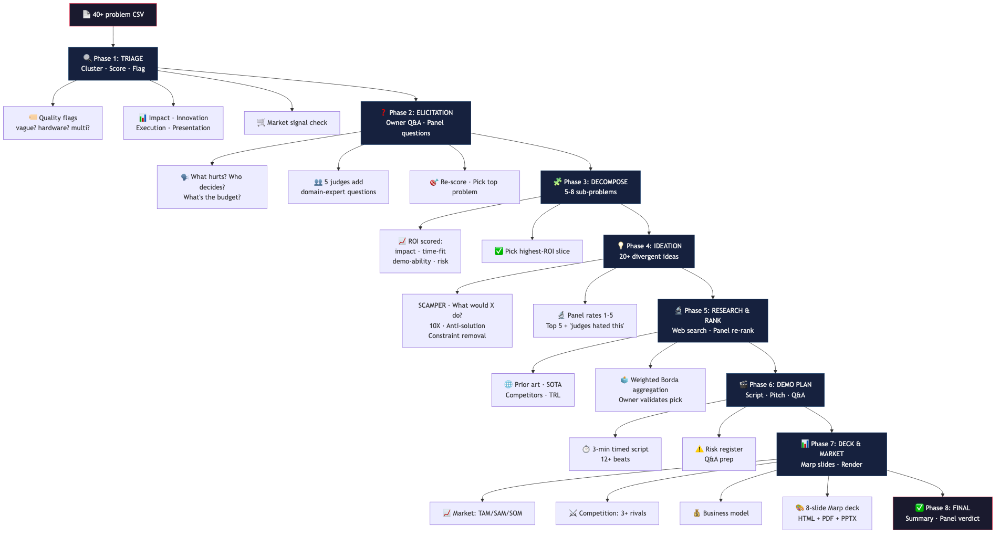

<!-- _class: lead -->

# Hackathon Best Practices

**Problem selection. Elicitation. Validation. Ideation. Ranking.**

An agent that guides you through every step — with 12 domain-expert judges reviewing your work.

Built on [Marp](https://marp.app)

---

## The Goal

Most hackathon teams wing it. They pick a problem on gut feel, brainstorm 3 obvious solutions, and hope.

This agent enforces **battle-tested practices**:



Every arrow is a concrete prompt template. The LLM follows a script — not free-form improvisation.

---

## Phase 1: Problem Selection

**Goal:** Pick the right problem — not the first one, not the easiest one.

```
  40+ raw problems
        │
   ┌────▼────┐     ┌──────────────┐
   │ Cluster │ ──► │ 3 clusters   │ scored on:
   │ by theme│     │ with scores  │ impact, innovation,
   └─────────┘     └──────────────┘ execution, presentation
        │
   ┌────▼────┐
   │ Quality │  vague? multi-problem? requires-hardware?
   │  flags  │  Flag early. Kill fast.
   └─────────┘
```

Market-signal check per cluster: *"Are there funded competitors? What's already deployed?"*

---

## Phase 2: Problem Elicitation

**Goal:** Stop solving the wrong problem. Ask the owner.

```
    Top-3 candidates
          │
   ┌──────▼───────┐
   │  Owner Q&A   │  What hurts most? What did you try?
   │  (real/sim)  │  Who decides? What defines success?
   └──────┬───────┘   What's the environment?
          │
   ┌──────▼───────┐
   │  Judge Q&A   │  Each panel judge adds 2-3 hard questions
   │  (5 judges)  │  from their domain expertise
   └──────┬───────┘
          │
     Re-score candidates with answers → User picks 1
```

In `owner_mode: real`, the agent asks YOU these questions. In `sim`, it role-plays a defense industry persona.

---

## Phase 3: Sub-Problem Decomposition

**Goal:** Break the problem into tractable chunks. Pick the highest-ROI slice for 48 hours.

```
  Chosen problem
        │
  ┌─────▼──────┐
  │ 5-8 sub-   │  SP-1: Real-time feed ingestion
  │ problems   │  SP-2: Threat prioritization engine
  └─────┬──────┘  SP-3: COA recommendation generator
        │         SP-4: Operator-facing dashboard
        │         SP-5: Multi-domain data fusion
  ┌─────▼──────┐
  │ ROI scored │  impact · time-fit · demo-ability · dependency-risk
  └────────────┘
```

Panel reviews: each judge scores every sub-problem independently. Convergent picks = strong signal.

---

## Phase 4: Divergent Ideation

**Goal:** Generate 20+ ideas before converging. Avoid "obvious = best."

```
  7 techniques:
  ┌──────────┐  ┌──────────┐  ┌──────────┐  ┌──────────┐
  │ SCAMPER  │  │ What     │  │ 10X      │  │ Anti-    │
  │ (3 ideas)│  │ would X  │  │ version  │  │ solution │
  │          │  │ do? (3)  │  │ (3 ideas)│  │ (3 ideas)│
  └──────────┘  └──────────┘  └──────────┘  └──────────┘
  ┌──────────┐  ┌──────────┐  ┌──────────┐
  │ Constraint│ │ Analogy  │  │ Wildcard │
  │ removal  │  │ transfer │  │ (2+ ideas)│
  │ (3 ideas)│  │ (3 ideas)│  │          │
  └──────────┘  └──────────┘  └──────────┘
        │
   ┌────▼─────┐     ┌──────────────┐
   │ Dedupe   │ ──► │ Panel rates  │  Top 5 + "judges hated this"
   │ Jaccard  │     │ each 1-5     │
   └──────────┘     └──────────────┘
```

---

## Phase 5: Validation & Ranking

**Goal:** Research, don't guess. Let 5 domain experts rank, not just your team.

```
  Top-5 ideas
       │
  ┌────▼─────┐    Web search per idea: prior art, SOTA, funded
  │ Research │    competitors, TRL estimates, regulatory pathway
  └────┬─────┘
       │
  ┌────▼─────┐    Each judge re-scores with research in mind.
  │  Panel   │    Weighted Borda aggregation.
  │ re-rank  │    Spread = genuine disagreement? (good!)
  └────┬─────┘
       │
  ┌────▼─────┐    Owner (real or sim) validates the ranking.
  │  Owner   │    Can override. Dissents recorded.
  │  picks   │
  └──────────┘
```

---

## Phase 6: Demo & Narrative

**Goal:** Hackathons are won in the demo, not the deck.

```
  Chosen solution
        │
  ┌─────▼──────┐  Smallest thing that demonstrates the "wow" moment
  │ Thin demo  │
  └─────┬──────┘
        │
  ┌─────▼──────┐  0:00 cold open → 0:20 problem → 0:40 live demo
  │ 3-min      │  → 2:00 how it works → 2:40 closing
  │ script     │  12+ timed beats
  └─────┬──────┘
        │
  ┌─────▼──────┐  8-12 questions from judges with prepared answers
  │ Q&A prep   │  + risk register (demo crashes, domain gaps...)
  └────────────┘
```

---

## The 12-Judge Panel

Cross-functional review at every phase. **No yes-men.**

| Judge | Role | Pet peeve |
|---|---|---|
| **Viper** | F-16 pilot, 2200 hrs | "Anything requiring a PhD to operate" |
| **Tran** | EW specialist, MITRE | "Hand-waved detection thresholds" |
| **Whitfield** | Defense prime PM | "No understanding of the buyer" |
| **Mehta** | CTO, ex-Palantir (always-on) | "Buzzword soup" |
| **Kovalenko** | Ukrainian drone operator | "Delicate hardware" |
| **Volkov** | Red-team adversary | "I'd defeat this in 6 months" |

Plus: procurement officer, ethics lawyer, defense VC, scaling engineer, intel analyst, UX designer.

```
/edth-agent panel viper  → Chat with any judge in character
```

---

## Phase 7: Market & Deck

**Goal:** Show you understand why it matters, who pays, and who else is trying.

```
  ┌───────────┐   ┌──────────────┐   ┌───────────────┐
  │ Market    │   │ Competition  │   │ Business      │
  │ TAM/SAM/  │   │ 3+ direct    │   │ model:        │
  │ SOM.      │   │ competitors. │   │ revenue model,│
  │ Trends.   │   │ Strengths,   │   │ pricing, GTM, │
  │ Buyer     │   │ weaknesses,  │   │ defensibility │
  │ personas. │   │ our edge.    │   │ (FAR pathway) │
  └───────────┘   └──────────────┘   └───────────────┘
          │               │                   │
          └───────────────┼───────────────────┘
                          ▼
                  8-slide Marp deck
             (HTML + PDF + PPTX fallback)
```

---

## Install & Try

```bash
git clone <repo> && cd edth-prob-solution-deck
python3 -m venv .venv && source .venv/bin/activate
pip install -e ".[dev]"
npm install -g @marp-team/marp-cli   # optional, for PDF
```

---

## One Command to Prove It Works

```bash
/edth-agent dry-run
```

30 seconds. Full pipeline. Zero interaction. Open `artefacts/07_deck.html`.

```bash
/edth-agent run       → Start a real run (interactive)
/edth-agent validate  → Check all artefacts for issues
/edth-agent skip-to 5 → Generate stubs for 0-4, jump to ranking
```

---

<!-- _class: lead -->

# Thank You

**Problem → Solution. With rigour.**
